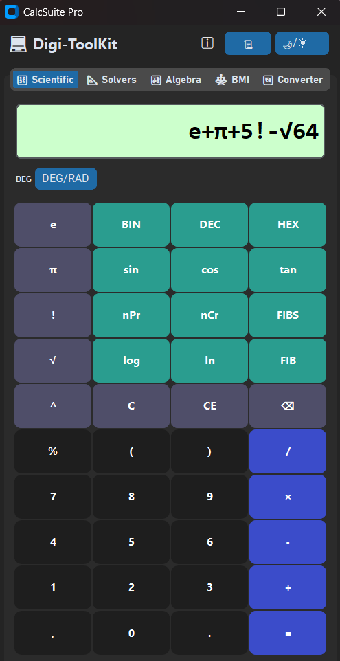
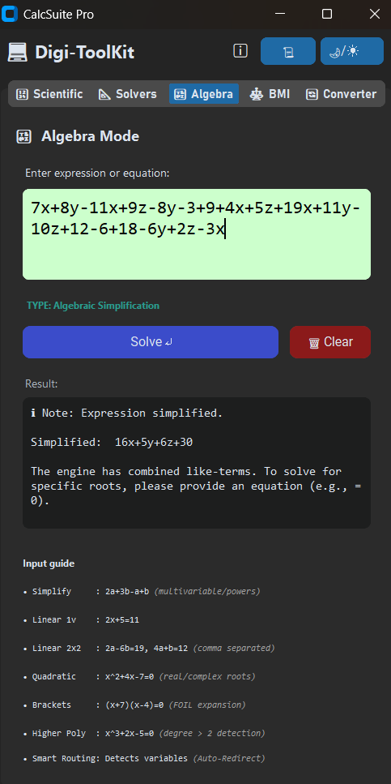
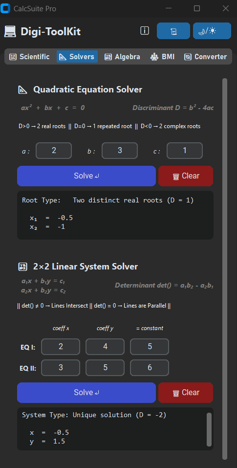
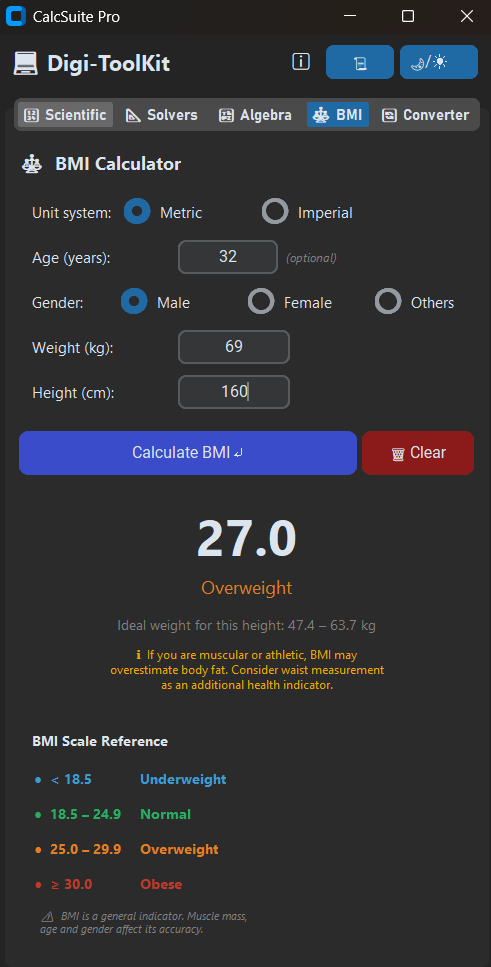
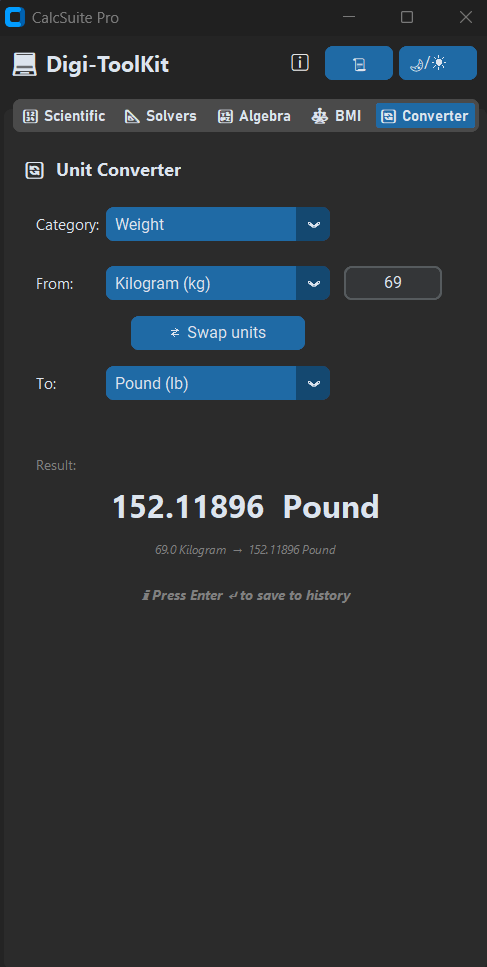

# 🧮 CalcSuite Pro: Digi-ToolKit
 


 
---
 
<p align="center">
  
  &nbsp;
  
</p>
<p align="center">
  
  &nbsp;
  
  &nbsp;
  
</p>
<p align="center"><i>Dark mode shown above. Light mode available via the 🌙/☀️ toggle.</i></p>
---
 
## 📌 Project Overview
 
**CalcSuite Pro** is a professional, multi-tool mathematical workstation built in Python using CustomTkinter. Designed to bridge the gap between simple arithmetic and complex algebraic analysis, it operates as a high-density **"Digi-ToolKit"** — five purpose-built calculators unified under a single, theme-aware interface.
 
The primary engineering goal was to build an application that balances deep mathematical capability with strict programmatic safety — completely neutralizing code-injection risks by replacing Python's standard `eval()` with a custom AST (Abstract Syntax Tree) evaluation engine.
 
> 📄 **Test Cases & Validation:** See [`Validation_and_Version_Report_CalcSuitePro.docx`](./Validation_and_Version_Report_CalcSuitePro.docx) for the full test suite and expected outputs for all five tabs.
 
---
 
## 🚀 Core Modules — The 5-Tab System
 
### 🔢 Tab 1 — Scientific Calculator *(The Engine)*
 
The backbone of the toolkit. Performs all standard and advanced scientific operations through a custom, injection-safe evaluation pipeline.
 
- **Secure Evaluation:** Expressions are parsed using Python's `ast` module into a syntax tree, then evaluated by a strict whitelist-only `eval_ast()` engine — `eval()` and `exec()` are never called
- **Implicit Multiplication:** Recognises `2π`, `2sin(30)`, `2(5+3)` natively without extra input
- **Postfix Function Input:** Type the number first, then press the function — `90 → sin` produces `sin(90)`, matching physical calculator behaviour
- **Smart Redirect:** Detects algebraic variable input (e.g. `2x+5`) and carries the expression directly to the Algebra tab with a 450ms transition delay
- **Trigonometry:** `sin`, `cos`, `tan` with persistent DEG / RAD mode toggle
- **Logarithms:** `log` (base 10), `ln` (natural log)
- **Combinatorics:** `nPr`, `nCr`, `n!` (factorial)
- **Fibonacci:** `FIB(n)` for the nth value; `FIBS(n)` for a full series (popup window for n > 10)
- **Base Conversion:** `BIN`, `HEX`, `DEC` real-time conversion
- **History:** 24-hour auto-pruning history shared across all tabs
- **UI:** Hover animations, click flash, dark/light theme toggle, keyboard support
**Keyboard Shortcuts:**
 
| Key | Action |
|---|---|
| `0–9`, `.`, `+`, `-`, `*`, `/`, `(`, `)`, `%` | Insert character |
| `Enter` | Calculate (same as `=`) |
| `Backspace` | Delete last character |
| `Delete` | Clear expression |
| `Escape` | Exit prompt |
 
---
 
### 📐 Tab 2 — Solvers *(The Specialist)*
 
Structured input solvers for standard equation types. Separate input fields prevent syntax errors.
 
**Quadratic Solver** — `ax² + bx + c = 0`
 
Uses `cmath.sqrt()` for full complex number support across all discriminant states:
 
| Discriminant (D) | Result |
|---|---|
| D > 0 | Two distinct real roots |
| D = 0 | One repeated real root |
| D < 0 | Two complex conjugate roots (shown as `a ± bi`) |
 
Special case: if `a = 0`, automatically falls back to linear equation `bx + c = 0`.
 
**Linear 2×2 Solver** — Cramer's Rule
 
Solves `a₁x + b₁y = c₁` and `a₂x + b₂y = c₂` using determinant calculation with an Epsilon tolerance (`1e-12`) to neutralise floating-point binary rounding errors:
 
| Determinant | Result |
|---|---|
| D ≠ 0 | Unique solution: x and y values |
| D = 0, Dₓ = 0 | Infinitely many solutions (same line) |
| D = 0, Dₓ ≠ 0 | No solution (parallel lines) |
 
---
 
### 🔣 Tab 3 — Smart Algebra *(The Master Logic)*
 
Free-form natural language input. Type expressions exactly as written — the engine auto-detects the type and routes to the correct solver.
 
**7-State Dispatcher:**
 
| Type | Input Example | Output |
|---|---|---|
| **Numeric Bypass** | `5 + 10 * 2` | `Result: 25` |
| **Simplification** | `3x^3-7x^2+8x^3+5y^2-3y^2` | `11x^3-x^2+2y^2` |
| **Linear (1 Var)** | `3x - 5 = 10` | `x = 5` |
| **Linear (2×2)** | `2a-6b=19, 4a+4b=12` | `a = 4.625, b = -1.625` |
| **Quadratic** | `x^2+4x-7=0` | Two real roots |
| **Bracket Expansion** | `(x+7)(x-4)(x+1)=0` | Expand iteratively → solve |
| **Polynomial Guard** | `x^3+2x=0` or `2xy+5=0` | Clear limitation message |
 
**Input Notes:**
- Use `^` for powers: `x^2`, `a^3`
- For a 2×2 system, separate equations with a comma: `2a-6b=19, 4a+4b=12`
- Constants can be on either side: `5x-8y-9=0` and `5x-8y=9` are equivalent
- `e` is treated as a **variable** in this tab (not Euler's number)
- Simplification works for any degree and any number of variables — no restrictions
**Architectural Boundary:** The Algebra engine is intentionally scoped to pattern extraction and polynomial dictionaries. It does not implement full CAS (Computer Algebra System) symbolic distribution, keeping the application lightweight and predictable.
 
**Known Limitations:**
- Equations with degree > 2 cannot be solved (but can be simplified freely if no `=` sign is present)
- Cross-variable terms (`xy`, `ab`) are detected and flagged — a CAS such as Wolfram Alpha is required for these
- Systems of 3 or more variables require a matrix solver
- Non-linear equations (Quadratics, FOIL/Bracket expansions) require all variables to be on the left side of the equals sign (i.e., the right side must evaluate to a pure number).
---
 
### ⚖️ Tab 4 — Health / BMI *(The Analytical)*
 
**Metric System:** `BMI = weight_kg / height_m²`
 
**Imperial System:** `BMI = 703 × weight_lb / total_inches²` where `total_inches = (feet × 12) + inches`
 
| BMI Range | Category |
|---|---|
| < 18.5 | Underweight |
| 18.5 – 24.9 | Normal weight |
| 25.0 – 29.9 | Overweight |
| ≥ 30.0 | Obese |
 
- **Age Guard:** Users under 18 receive the BMI value but are redirected to a percentile chart — adult thresholds do not apply to children
- **Gender Context:** Female users receive a body-fat distribution note; overweight/obese male users receive a muscle-mass caveat
- **Ideal Weight Range:** Back-calculated from BMI 18.5–24.9 for the entered height, displayed in the appropriate unit
- **Clear Button:** Resets all inputs and the result panel simultaneously
---
 
### 🔄 Tab 5 — Unit Converter *(The Utility)*
 
**Categories:** Length, Weight, Temperature, Speed, Area — covering 30+ unit pairs.
 
**Conversion Method:**
- All non-temperature units use a single base-unit ratio: `result = (input × from_factor) / to_factor`
- Temperature uses dedicated step-by-step formulas with Celsius as the intermediate base
**Features:**
- Live conversion updates on every keystroke
- **Swap ⇄** button reverses the conversion direction instantly
- History logged on Enter, unit dropdown change, or Swap — not on every keystroke, preventing history spam
---
 
## 🛠️ Architecture & Developer Notes
 
| Concern | Implementation |
|---|---|
| **Security** | Strict AST parsing for the Scientific tab — `eval()` and `exec()` never used anywhere in the codebase |
| **Precision** | Epsilon checks (`abs(val) < 1e-12`) across all solvers to eliminate floating-point binary rounding errors |
| **Engine Scope** | Algebra tab uses pattern extraction and polynomial dictionaries — deliberate boundary against full CAS symbolic distribution |
| **Regex Standards** | All regular expressions use raw strings (`r'...'`) to prevent `SyntaxWarning` in Python 3.12+ |
| **UX Timing** | 450ms state-transition delay — the psychological "Goldilocks" zone for readable UI prompts without artificial lag |
| **State Persistence** | Globally shared 24-hour auto-pruning `HistoryManager` tracks operations across all five tabs |
| **Typography** | Bahnschrift for tab navigation (high-density, no character slicing); Consolas for result output (monospaced precision) |
 
---
 
## 💻 Installation & Setup
 
### Prerequisites
 
Ensure you have **Python 3.10+** installed. The application requires one external library:
 
```bash
pip install customtkinter
```
 
> **Note:** On some operating systems, `pillow` may also be required as a dependency of CustomTkinter. If you encounter an image-related error on launch, run `pip install customtkinter pillow`.
 
### Recommended: Virtual Environment
 
Running inside a virtual environment isolates this project's dependencies from your global Python installation.
 
**1. Create the environment:**
```bash
python -m venv calc_env
```
 
**2. Activate the environment:**
 
Windows:
```bash
calc_env\Scripts\activate
```
 
macOS / Linux:
```bash
source calc_env/bin/activate
```
 
**3. Install dependencies:**
```bash
pip install customtkinter
```
 
**4. Launch the application:**
```bash
python calcSuite_pro.py
```
 
---
 
## 📈 Version History
 
A selection of the key milestone versions that shaped the final release.
 
| Version | Date | Status | Milestone |
|---|---|---|---|
| v1.0 | 30 Mar 2026 | Legacy | Initial deployment — basic arithmetic GUI using standard libraries |
| v3.2 | 03 Apr 2026 | Legacy | Multi-tool expansion — BMI and Unit Converter integrated |
| v5.0 | 09 Apr 2026 | Legacy | **Security overhaul** — CustomTkinter adopted; `eval()` replaced by strict AST parsing |
| v6.0–6.3 | 10–13 Apr 2026 | Legacy | Solvers tab built — Quadratic (real & complex), Linear 2×2 (Cramer's Rule), full validation |
| v7.0 | 15 Apr 2026 | Stable | **Smart Algebra introduced** — natural language parsing and 7-state dispatcher |
| v7.5 | 22 Apr 2026 | Stable | **"Pro" Overhaul** — Digi-ToolKit branding, smart cross-tab redirects, UX timing |
| v7.6 | 24 Apr 2026 | **Final** | **Stability update** — dictionary-based polynomial engine, Epsilon tolerance, legacy code pruned |
 
---
 
## 🎯 Conclusion
 
CalcSuite Pro demonstrates that a mathematically capable, multi-tool application can be built without sacrificing security or simplicity. Every feature — from the AST engine to the polynomial dispatcher — was designed with a deliberate architectural boundary in mind, ensuring the toolkit remains fast, predictable, and safe.
 
---
 
## 👤 Author
 
**Yousuf S. R. Sakkaf**

GitHub: [github.com/S-Yousuf-S/NHIS_Project2](https://github.com/S-Yousuf-S/NHIS_Project2)
 
---
 
⭐ *If you found this toolkit useful, consider it for evaluation!*
